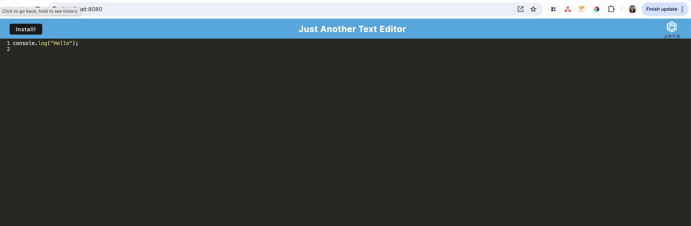

# PWA text editor

## Text editor that is a single page application

## Features

- offers data persistence
- The app can run offline

## Installation Instructions

- Download the files from the repo
- Run `npm install` to install the necessary dependencies
- Run `npm start` which will compile and open the single page application. 
- You will be able to install the application to run offline

## Website Preview

## Working Example
[View the website here](https://gcsdesign-blog-43fec2242915.herokuapp.com/)

